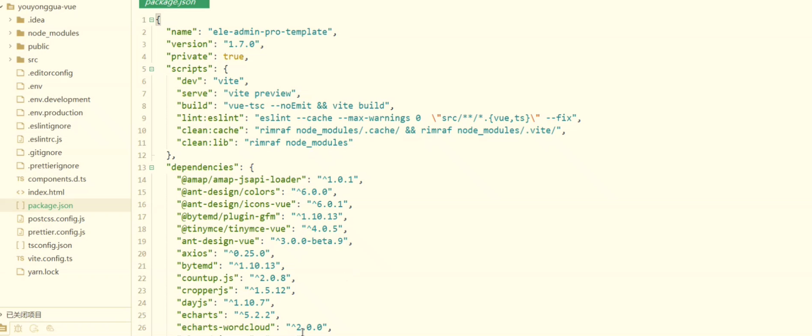

# 游泳馆系统-预报报名系统-场地系统

#### 介绍
🔥🔥🔥本项目完全开源，采用的技术是SpringBoot+Vue+Mysql+Mybatis，项目非常的nice，带详细的部署教程。可以用于学习或者二次开发，感谢提出宝贵的建议，技术交流微：fly996868

喜欢项目的朋友感谢star和fork。

#### 软件架构

系统的技术栈如下所示

#### 系统的功能介绍

系统的权限分为前台和后台。

前台的功能：登录、注册、场地查看、列表查看、课程查看、公告查看、在线预约场地

后台的功能：登录、用户管理、场地管理、预约信息管理、 报名信息管理、会员信息管理、数据统计

系统的架构图如下所示：

.png)

#### 系统演示

#### 参与贡献

1.  小孟
2.  时光踏路已久
3.  harlan

#### 感谢

1. 整理项目和开发项目不易，觉得项目还不错的小伙伴，感谢是start和fork。

2. star的小伙伴可以和交流哦！

3. 感谢 wwww.javaclimb.com的支持# swimming-pool-system
